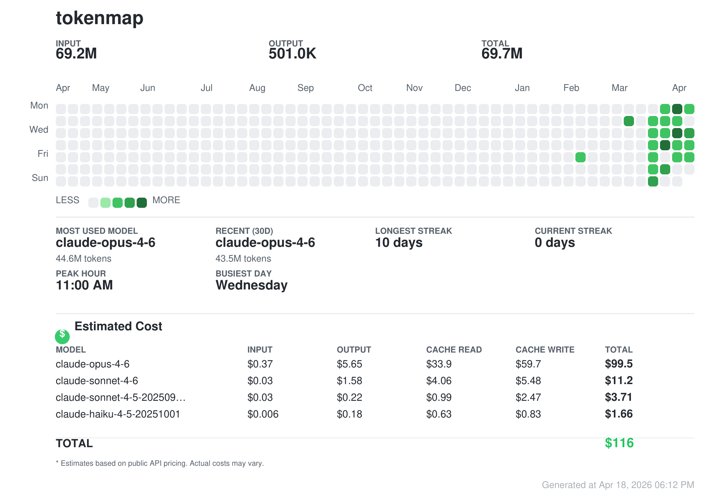

<div align="center">

# tokenmap

**Your AI coding stats, visualized.**

A GitHub-style contribution heatmap that shows how much you actually use AI coding tools.
One command. Auto-detected. Shareable.

[](https://pypi.org/project/tokenmap/)
[](https://github.com/akshatshaw/tokenmap/blob/main/LICENSE)

</div>

---



```
pip install tokenmap
tokenmap
```

That's it. It reads your local data, renders a heatmap in your terminal, and exports a shareable PNG.

## Supported Tools

| Tool            | Data Source                      | What's Tracked                    |
| --------------- | -------------------------------- | --------------------------------- |
| **Claude Code** | `~/.claude/stats-cache.json`     | Tokens, models, sessions, costs   |
| **Codex CLI**   | `~/.codex/sessions/*.jsonl`      | Tokens, models, session durations |
| **OpenCode**    | `~/.local/share/opencode/`       | Tokens, models, messages          |
| **Cursor**      | Cursor API + local `state.vscdb` | Tokens, models, usage events      |

tokenmap auto-detects which tools you have installed. No configuration needed.

## Install

```bash
pip install tokenmap
```

Requires **Python 3.10+**.

### System Dependencies

For PNG export, you need [Cairo](https://cairographics.org/) installed:

```bash
# macOS
brew install cairo

# Ubuntu/Debian
sudo apt install libcairo2-dev

# Fedora
sudo dnf install cairo-devel
```

## Usage

```bash
# Basic — auto-detect all tools, export PNG
tokenmap

# Add your name to the heatmap
tokenmap --user yourname

# Filter to a specific tool
tokenmap --claude
tokenmap --codex
tokenmap --cursor
tokenmap --opencode

# Filter to a specific year
tokenmap --year 2025

# Change the color theme
tokenmap --theme dark-green

# Export as SVG instead of PNG
tokenmap --export svg

# Custom output path
tokenmap --out ~/Desktop/my-ai-usage.png

# Terminal only, no file export
tokenmap --no-export

# Copy PNG to clipboard (macOS/Linux/Windows)
tokenmap --copy

# Dump raw stats as JSON (for scripting)
tokenmap --json

# Show estimated cost breakdown by model
tokenmap --cost
tokenmap --claude --cost

# See all themes
tokenmap --list-themes
```

## Themes

10 built-in themes — 5 light, 5 dark:

| Dark          | Light             |
| ------------- | ----------------- |
| `dark-ember`  | `green` (default) |
| `dark-green`  | `purple`          |
| `dark-purple` | `blue`            |
| `dark-blue`   | `amber`           |
| `dark-mono`   | `mono`            |

## Options

| Flag             | Description                            | Default        |
| ---------------- | -------------------------------------- | -------------- |
| `--user <name>`  | Username shown on the heatmap          | —              |
| `--claude`       | Include only Claude Code data          | —              |
| `--codex`        | Include only Codex data                | —              |
| `--opencode`     | Include only OpenCode data             | —              |
| `--cursor`       | Include only Cursor data               | —              |
| `--theme <name>` | Color theme                            | `green`        |
| `--export <fmt>` | Export format: `png` or `svg`          | `png`          |
| `--no-export`    | Skip file export, terminal only        | —              |
| `--out <path>`   | Custom output file path                | `tokenmap.png` |
| `--copy`         | Copy PNG to clipboard after export     | —              |
| `--year <year>`  | Filter to a specific year              | last 365 days  |
| `--json`         | Output raw stats as JSON               | —              |
| `--cost`         | Show estimated cost breakdown by model | —              |
| `--list-themes`  | Show all available themes              | —              |

## Programmatic Usage

```python
from tokenmap import aggregate_multi, render_terminal, render_svg, compute_stats
from tokenmap.types import RenderOptions

# Load data from all detected tools
panels = aggregate_multi()

# Render to terminal
render_terminal(panels, RenderOptions(theme="dark-green", user="myname"))

# Generate SVG
svg_string = render_svg(panels, RenderOptions(theme="dark-green", user="myname"))

# Access raw stats
for panel in panels:
    print(f"{panel.tool}: {panel.stats.total_tokens} tokens")
```

## How It Works

tokenmap reads **locally stored data** from your AI coding tools. It never sends data anywhere — everything stays on your machine.

1. **Detect** — scans for installed tool data directories
2. **Aggregate** — merges token usage, sessions, and model stats across tools
3. **Render** — generates a terminal heatmap + exportable image
4. **Export** — saves a high-res PNG/SVG with stats panel

### Privacy

- All data is read **locally** from your filesystem
- Nothing is uploaded or transmitted
- The only network request is Cursor's API (to fetch your own usage CSV, using your local auth token) — and even that's optional with a loca

## Attribution

This project is a Python port of [tokenviz](https://github.com/harshkedia177/tokenviz) by Harsh Kedia.
Original source: [https://github.com/harshkedia177/tokenviz](https://github.com/harshkedia177/tokenviz)

Licensed under MIT. Original copyright retained.

## License

MIT
