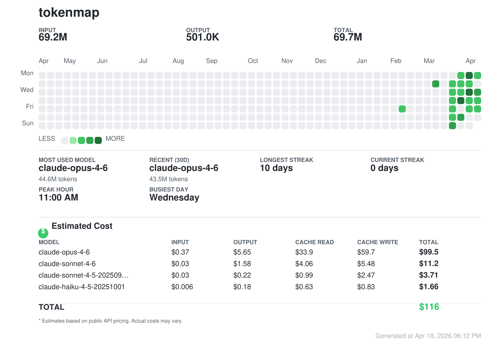

<div align="center">

# tokenmap

**Your AI coding stats, visualized.**

A GitHub-style contribution heatmap that shows how much you actually use AI coding tools.
One command. Auto-detected. Shareable.

[](https://pypi.org/project/tokenmap/)
[](https://github.com/akshatshaw/tokenmap/blob/main/LICENSE)

</div>

---



```
pip install tokenmap
tokenmap
```

That's it. It reads your local data and renders a heatmap — plus an estimated cost breakdown — right in your terminal.

By default `tokenmap` includes your Claude Code data (and auto-detects any other installed tools), uses the `dark-green` theme, shows the cost breakdown, and stays terminal-only. Pass `--export png` (or `svg`/`csv`) when you want a shareable file.

## Supported Tools

| Tool            | Data Source                      | What's Tracked                    |
| --------------- | -------------------------------- | --------------------------------- |
| **Claude Code** | `~/.claude/stats-cache.json`     | Tokens, models, sessions, costs   |
| **Codex CLI**   | `~/.codex/sessions/*.jsonl`      | Tokens, models, session durations |
| **OpenCode**    | `~/.local/share/opencode/`       | Tokens, models, messages          |
| **Cursor**      | Cursor API + local `state.vscdb` | Tokens, models, usage events      |

tokenmap auto-detects which tools you have installed. No configuration needed.

## Install

```bash
pip install tokenmap
```

Requires **Python 3.10+**.

### System Dependencies

For PNG export, you need [Cairo](https://cairographics.org/) installed:

```bash
# macOS
brew install cairo

# Ubuntu/Debian
sudo apt install libcairo2-dev

# Fedora
sudo dnf install cairo-devel
```

## Usage

```bash
# Basic — Claude + any other auto-detected tools, cost breakdown, terminal only
tokenmap

# Add your name to the heatmap
tokenmap --user yourname

# Pick tools (Claude is always included unless you pass --no-claude)
tokenmap --codex                 # Claude + Codex
tokenmap --no-claude             # everything detected EXCEPT Claude
tokenmap --no-claude --cursor    # Cursor only

# Filter by date
tokenmap --year 2025
tokenmap --since 2026-01-01 --until 2026-01-31
tokenmap --since 2026-05-01      # from a date through today

# Filter to one model (substring match)
tokenmap --model claude-opus-4-7
tokenmap --model opus            # every Opus variant

# Change the color theme (default is dark-green)
tokenmap --theme green

# Export a shareable file (off by default)
tokenmap --export png
tokenmap --export svg
tokenmap --export csv            # per-day token + cost rows
tokenmap --out ~/Desktop/my-ai-usage.png   # implies export, format from extension

# Copy PNG to clipboard (implies PNG export)
tokenmap --copy

# Dump raw stats as JSON (to stdout, or to a file with --out)
tokenmap --json
tokenmap --json --out stats.json

# Hide the cost breakdown (shown by default)
tokenmap --no-cost

# See all themes
tokenmap --list-themes
```

## Themes

10 built-in themes — 5 light, 5 dark:

| Dark                 | Light    |
| -------------------- | -------- |
| `dark-ember`         | `green`  |
| `dark-green` (default) | `purple` |
| `dark-purple`        | `blue`   |
| `dark-blue`          | `amber`  |
| `dark-mono`          | `mono`   |

## Options

| Flag                  | Description                                              | Default          |
| --------------------- | ------------------------------------------------------- | ---------------- |
| `--user <name>`       | Username shown on the heatmap                           | —                |
| `--claude / --no-claude` | Include Claude Code data                             | on               |
| `--codex`             | Also include Codex data                                 | off              |
| `--opencode`          | Also include OpenCode data                              | off              |
| `--cursor`            | Also include Cursor data                                | off              |
| `--theme <name>`      | Color theme                                             | `dark-green`     |
| `--export <fmt>`      | Write a file: `png`, `svg`, or `csv`                    | off (terminal only) |
| `--no-export`         | Force terminal-only output (overrides `--export`/`--out`) | —              |
| `--out <path>`        | Custom output path (implies export; format from extension) | —             |
| `--copy`              | Copy PNG to clipboard (implies PNG export)              | —                |
| `--year <year>`       | Filter to a specific year                               | last 365 days    |
| `--since <date>`      | Start date, inclusive (`YYYY-MM-DD`)                    | —                |
| `--until <date>`      | End date, inclusive (`YYYY-MM-DD`)                      | —                |
| `--model <name>`      | Filter to models matching this name (substring)         | all models       |
| `--json`              | Output raw stats as JSON (to stdout, or `--out` file)   | —                |
| `--cost / --no-cost`  | Show estimated cost breakdown by model                  | on               |
| `--list-themes`       | Show all available themes                               | —                |

## Programmatic Usage

```python
from tokenmap import aggregate_multi, render_terminal, render_svg, compute_stats
from tokenmap.types import RenderOptions

# Load data from all detected tools
panels = aggregate_multi()

# Render to terminal
render_terminal(panels, RenderOptions(theme="dark-green", user="myname"))

# Generate SVG
svg_string = render_svg(panels, RenderOptions(theme="dark-green", user="myname"))

# Access raw stats
for panel in panels:
    print(f"{panel.tool}: {panel.stats.total_tokens} tokens")
```

## How It Works

tokenmap reads **locally stored data** from your AI coding tools. It never sends data anywhere — everything stays on your machine.

1. **Detect** — scans for installed tool data directories
2. **Aggregate** — merges token usage, sessions, and model stats across tools
3. **Render** — generates a terminal heatmap + cost breakdown
4. **Export** *(optional)* — with `--export`, saves a high-res PNG/SVG with stats panel, or a CSV of per-day tokens + cost

### Privacy

- All data is read **locally** from your filesystem
- Nothing is uploaded or transmitted
- The only network request is Cursor's API (to fetch your own usage CSV, using your local auth token) — and even that's optional, with a local-only fallback that reads Cursor's `state.vscdb` on your machine when the API is unavailable.

## Attribution

This project is a Python port of [tokenviz](https://github.com/harshkedia177/tokenviz) by Harsh Kedia.
Original source: [https://github.com/harshkedia177/tokenviz](https://github.com/harshkedia177/tokenviz)

Licensed under MIT. Original copyright retained.

## License

MIT
